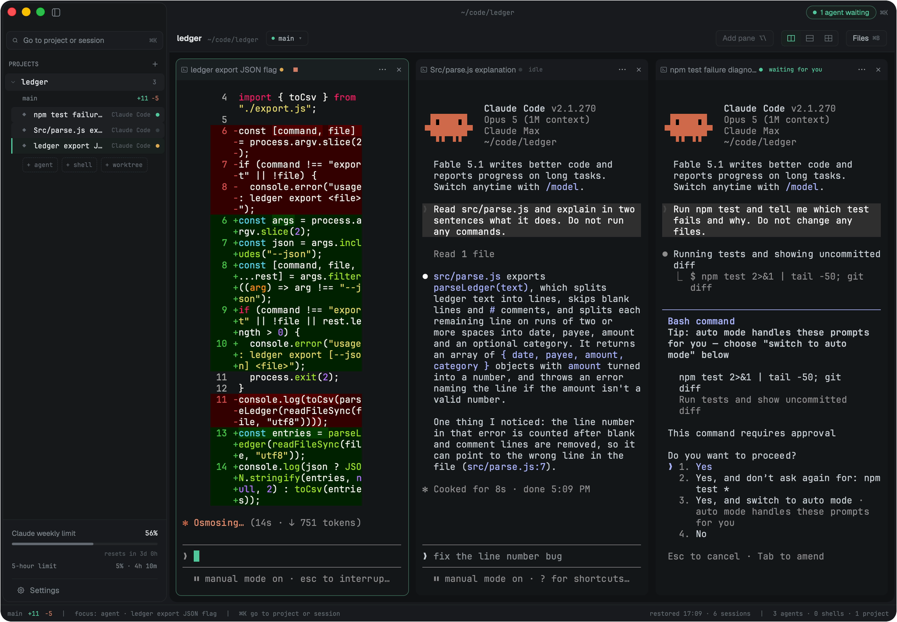
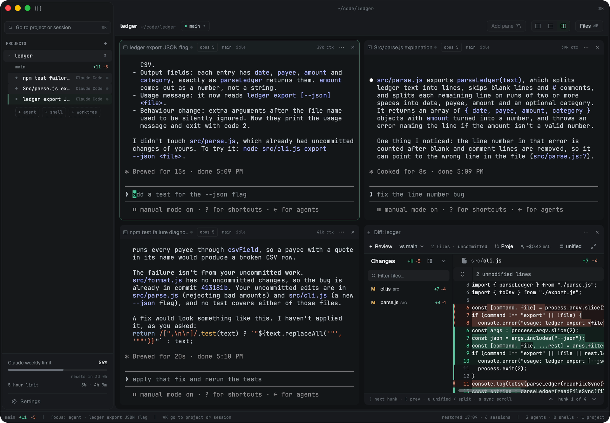

<div align="center">
  
  <h1>Splitlane</h1>
  <p><strong>Run Claude Code, Codex and other coding agents side by side,<br />and see at a glance which one is waiting for you.</strong></p>
  <p>
    <a href="#install">Install</a> ·
    <a href="#how-it-knows">How it knows</a> ·
    <a href="#what-is-in-the-window">What is in the window</a> ·
    <a href="#faq">FAQ</a> ·
    <a href="#docs">Docs</a>
  </p>
</div>

<picture>
  <source media="(prefers-color-scheme: light)" srcset="assets/images/hero-light.png" />
  
</picture>
<p align="center"><sub>Three agents in one project. One is working, one has finished, and one is asking to run <code>npm test</code> - the rail, its pane header and the title bar all say so.</sub></p>

https://github.com/user-attachments/assets/2bec9393-2fdd-453e-a94c-4d4fd92da115

Splitlane is a native desktop app for supervising several CLI coding agents at
once. Every agent runs in a real terminal pane, exactly as it would in your own
terminal. What Splitlane adds is the part a terminal cannot tell you: which
session is working, which has finished, and which is stopped on a question for
you - read from the agents themselves, not guessed from terminal activity.

It is written in Rust on [Zed's GPUI](https://github.com/zed-industries/zed/tree/main/crates/gpui),
runs on macOS, Linux and Windows, and keeps everything local: the agents are
the CLIs you already use, with your own accounts.

> **Status: early.** Splitlane is used daily on macOS (Apple Silicon). Linux
> (x86_64, aarch64) and Windows (x64) are built and tested in CI but have had
> far less hands-on use. There are no release builds yet - see
> [Install](#install).

## How it knows

A status dot you cannot trust is worse than none, so each agent's state comes
from the best source that agent offers - and the sources are not equal:

- **Claude Code and Codex** are read directly from their own session records -
  Claude Code's status file and transcript, Codex's rollout - plus the process
  tree under the pane. A permission prompt,
  a running tool call and a finished turn are told apart from what the agent
  recorded, not from whether the terminal is printing.
- **Eight more** - Gemini, Cursor, OpenCode, Pi, Hermes Agent, Grok, CodeBuddy
  and Qoder - report through hooks that a small shim on the pane's `PATH`
  installs for the length of the session.
- **The last six** - Copilot, Kiro, Factory, Antigravity, Openclaw and Amp -
  expose no hook surface Splitlane can use. For them it knows only that the
  process is running and when it exits, so their row can say `running` while
  the agent is in fact waiting for you.

Five words, everywhere a session is listed: `starting`, `running`,
`waiting for you`, `idle`, `failed`. A finished run you have not looked at yet
stays marked until its pane is on screen, so a pile of uncollected results does
not go quiet. You answer an agent in its own terminal; there is no second
approval UI to keep in sync.

## What is in the window

<picture>
  <source media="(prefers-color-scheme: light)" srcset="assets/images/grid-diff-light.png" />
  
</picture>
<p align="center"><sub>The same project as a grid of four: the three agents and the diff of what they changed.</sub></p>

- **Panes.** A project's panes are a row, a column, or a grid of four. `⌥\`
  adds a pane; an empty pane lists the agents on your `PATH`, this project's
  open sessions and its past sessions, and you pick one inside the pane.
- **The rail.** One list of projects, each expanding to its sessions with their
  status. `⌥⇥` jumps to the next session waiting for you.
- **Diff.** A project's uncommitted changes, with a file list, a filter and a
  revision picker, in a pane next to the agents that made them.
- **Files.** A tree of the project with git change marks (`⌘B`).
- **Limits.** Your Claude and Codex plan usage in the rail, with when it resets.
- **Sessions survive a restart.** Claude Code sessions resume into the same
  conversation.
- **Notifications** when a session is waiting, has failed, or (optionally) has
  finished - only for sessions you cannot currently see.
- **Presets.** A saved set of panes, each with its own directory and agent,
  started from the Launch pad (`⇧⌘L`) or with `splitlane up`.
- **For agents.** A read-only MCP bridge (`splitlane mcp install`) lets one
  agent read another pane's output, and a local CLI and JSON-RPC socket
  (`splitlane ls`, `read`, `send`, `wait`, `watch`) script the app. Anything
  that types into a pane is off until you enable it.

Supported agents: Claude Code, Codex, OpenCode, Gemini, Cursor, Copilot, Amp,
Pi, Hermes Agent, Grok, Kiro, Antigravity, CodeBuddy, Factory, Qoder and
Openclaw. Any other CLI runs in an ordinary shell pane.

Keys above are macOS; Linux and Windows use `Ctrl`-based equivalents that do
not collide with readline. The full list is in Settings → Shortcuts and
[docs/user/keybindings.md](docs/user/keybindings.md).

## Install

**There are no release builds yet** - for now Splitlane is built from source.
Signed installers need an Apple Developer identity and a Windows code-signing
certificate this project does not have yet; binaries will be published on the
[Releases](https://github.com/ivkan/splitlane/releases) page once they exist,
and this section will say how to open them.

### Build from source

Install Rust with [rustup](https://rustup.rs); the exact toolchain is pinned in
[rust-toolchain.toml](rust-toolchain.toml) and is picked up automatically. Then
the platform's build tools:

- **macOS** (Apple Silicon): Xcode. GPUI compiles its Metal shaders with
  `xcrun metal`, and the Metal compiler ships with Xcode, not with the Command
  Line Tools alone.
- **Linux** (x86_64, aarch64): Vulkan and the Wayland/X11 development
  libraries. On Debian or Ubuntu:

  ```bash
  sudo apt-get install libvulkan-dev libwayland-dev libxkbcommon-dev \
    libxkbcommon-x11-dev libx11-dev libxcb1-dev libxcb-render0-dev \
    libxcb-shape0-dev libxcb-xfixes0-dev libfontconfig1-dev libfreetype6-dev
  ```

- **Windows** (x64): Visual Studio Build Tools with the C++ workload (MSVC).

```bash
git clone https://github.com/ivkan/splitlane.git
cd splitlane
cargo run --release -p splitlane-app
```

The binary is `target/release/splitlane` (`splitlane.exe` on Windows). A
first build takes several minutes: GPUI and its dependencies are compiled from
source.

## FAQ

**Why not tmux with one agent per pane?**
tmux shows you the panes; it cannot tell you which agent is blocked on a
question. If you work over SSH or want something headless, use tmux. Splitlane
is for supervising agents on your own machine, where knowing who is waiting is
the whole job.

**Is it an Electron app?**
No. It is Rust on GPUI, rendering with Metal on macOS, Vulkan on Linux and
DirectX on Windows.

**Does it run agents for me, or in the cloud?**
Neither. The agents are the CLIs installed on your machine, signed in with your
own accounts, running in ordinary terminals. Splitlane never sends a prompt on
its own; scripted input is off until you enable it.

**Can other agents read my terminals?**
Only agents you register with the MCP bridge, and only to read. Output it hands
to an agent is marked as untrusted content.

**Does it phone home?**
Only if you opt in. Telemetry never includes terminal contents, paths or
prompts, and `SPLITLANE_NO_TELEMETRY=1` turns it off regardless of settings.

## Docs

- [User guide](docs/user/index.md) - installation, layouts, configuration, themes
- [Scripting](docs/user/scripting.md) - the CLI, `splitlane up` and the JSON-RPC socket
- [MCP bridge](docs/mcp-bridge.md) - letting agents read other panes
- [Windows notes](docs/WINDOWS.md) - support matrix and caveats
- [Architecture](ARCHITECTURE.md) and [design decisions](docs/internals/design-decisions.md) - for contributors
- [Contributing](CONTRIBUTING.md) - building, the checks a pull request runs, and how to send one
- [AGENTS.md](AGENTS.md) - instructions for coding agents working on this repository

## Acknowledgements

Splitlane is based on [arthjean/paneflow](https://github.com/arthjean/paneflow)
by Arthur Jean, and is distributed under the same license. It has been modified
since 2026.

Bundled icons and fonts keep their own licenses; see
[THIRD_PARTY_NOTICES.md](THIRD_PARTY_NOTICES.md). Product names, logos and
brands shown in Splitlane (agent CLIs, editors, programming languages) are
trademarks of their respective owners and are used only to identify those
tools. Splitlane is not affiliated with or endorsed by them.

## License

[GPL-3.0-or-later](LICENSE)
